<p align="center">
  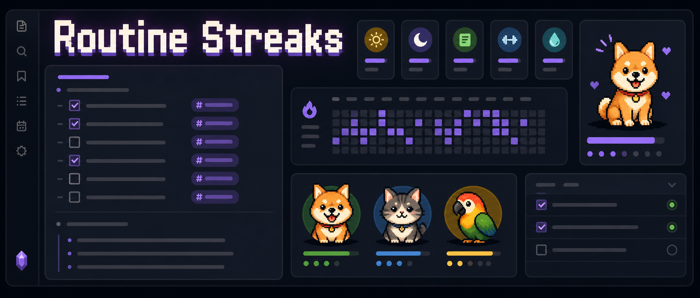
</p>

<p align="center">
  <a href="https://github.com/HolyHooly/routine-streaks/releases"></a>
  
  
  
  
</p>

<p align="center">
  <strong>Track routine streaks from plain Markdown checkboxes, then carry them to your iPhone home screen.</strong><br>
  Daily Notes stay as the source of truth while Routine Streaks exports widget-ready data and generates Scriptable code for iOS/iPadOS.
</p>

<p align="center">
  <a href="#highlights">Highlights</a> ·
  <a href="#screenshots">Screenshots</a> ·
  <a href="#usage">Usage</a> ·
  <a href="#markdown-widgets">Markdown widgets</a> ·
  <a href="#scriptable-widgets">Scriptable widgets</a>
</p>

<p align="center">
  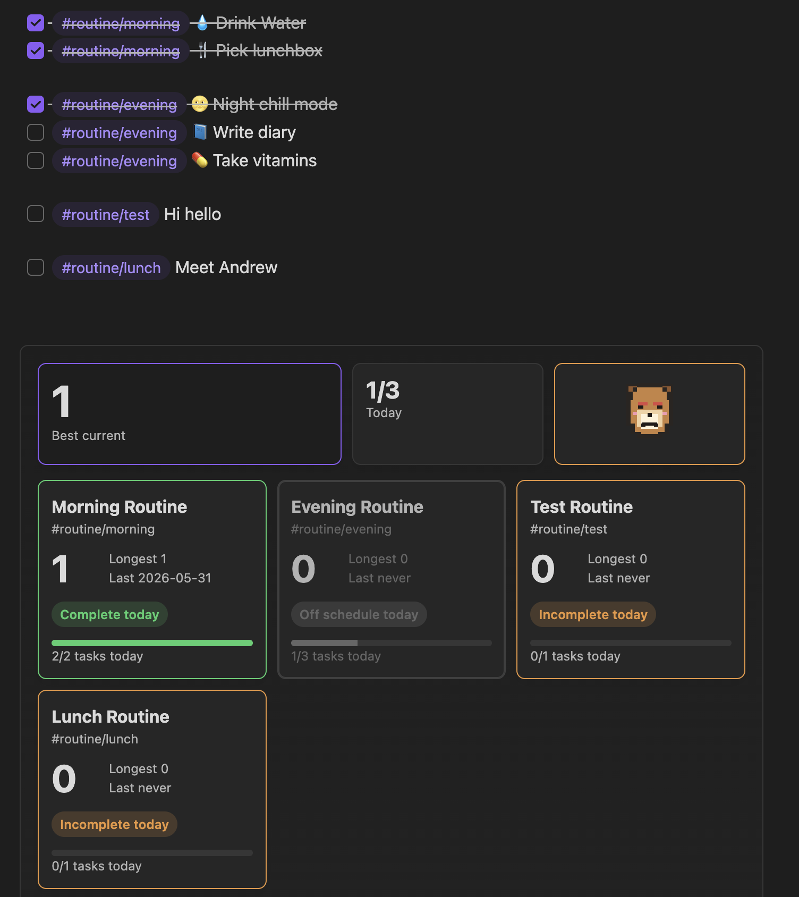
</p>

## Highlights

|                          |                                                                                    |
| ------------------------ | ---------------------------------------------------------------------------------- |
| ✅ Markdown-first streaks | Completion history comes from tagged Daily Note checkboxes, not a hidden database. |
| 🗓️ Flexible schedules   | Use selected weekdays, weekly targets, or repeating day/week intervals.            |
| 🧊 Freeze days           | Pause a routine for breaks, travel, sick days, or planned rest.                    |
| 🧩 Routine templates     | Define template items once, then insert routine tasks from the command palette.    |
| 📊 Widgets everywhere    | View progress in the sidebar, inside notes, and on iOS/iPadOS through Scriptable.  |
| 🐾 Pixel pet status      | Pick a dog, cat, or parrot that reacts to today's routine progress.                |

## Screenshots

### Routine Management

<p align="center">
  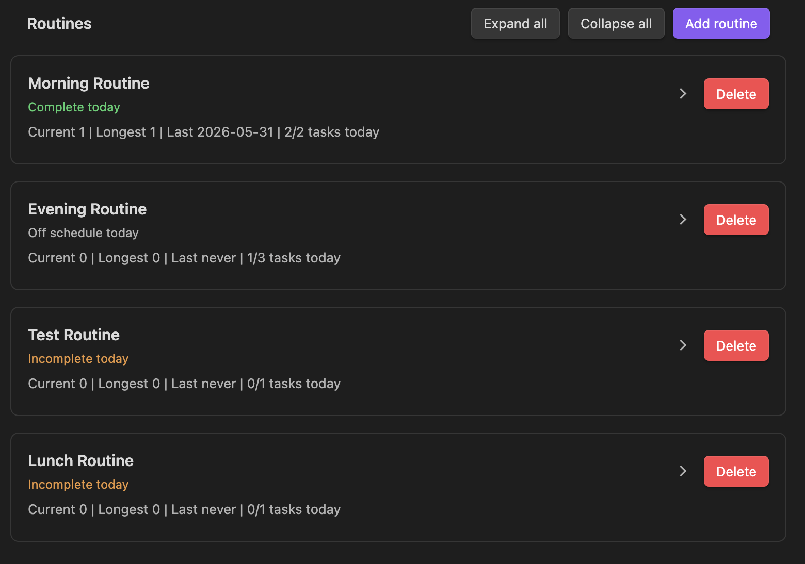
</p>

<p align="center">
  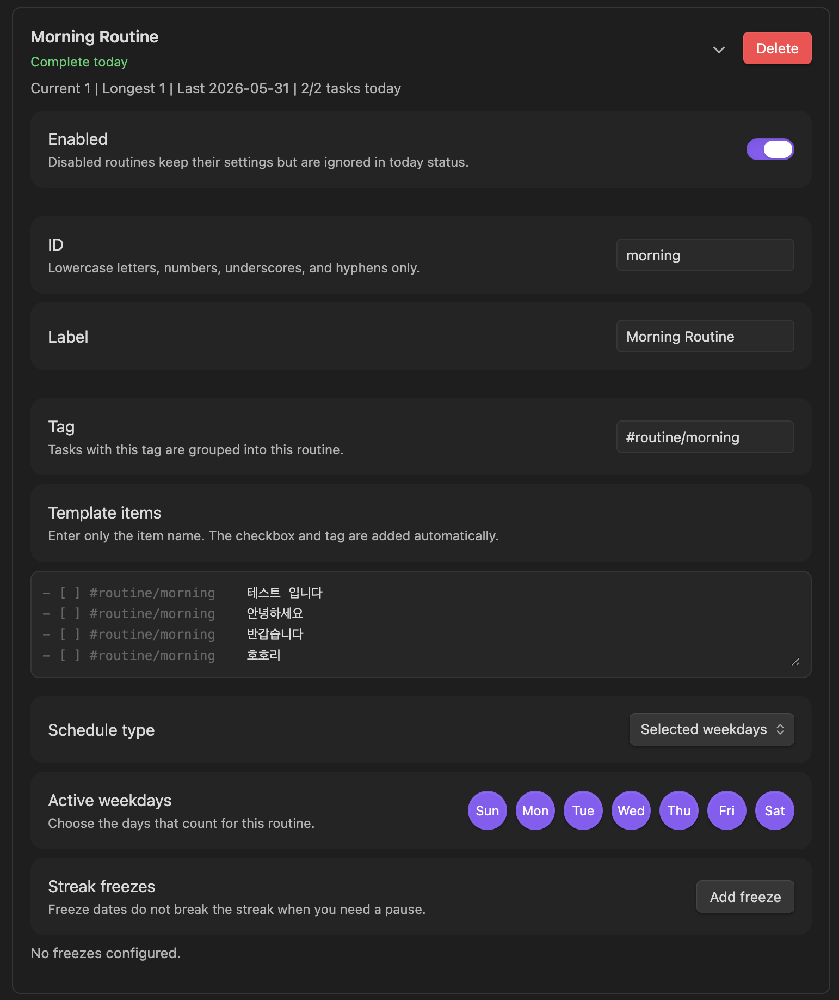
</p>

### Pixel Pets

<table>
  <tr>
    <th>Pet</th>
    <th>Complete</th>
    <th>Needs attention</th>
  </tr>
  <tr>
    <td>Dog</td>
    <td>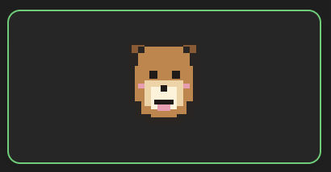</td>
    <td>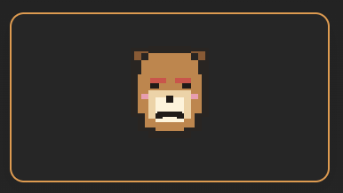</td>
  </tr>
  <tr>
    <td>Cat</td>
    <td>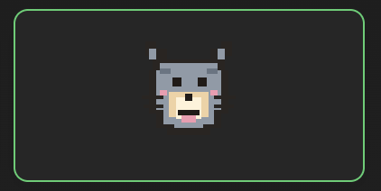</td>
    <td>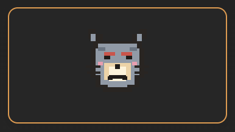</td>
  </tr>
  <tr>
    <td>Parrot</td>
    <td>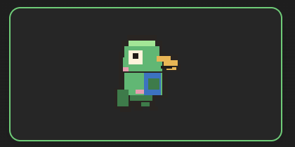</td>
    <td>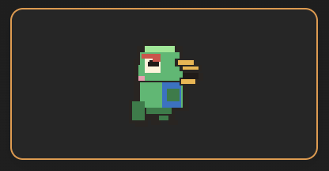</td>
  </tr>
</table>

## How It Works

Routine Streaks treats your Daily Notes as the source of truth.

```markdown
- [ ] Drink water #routine/morning
- [x] Open the journal #routine/morning
```

For each routine, the plugin scans Daily Notes for tasks with the routine tag. A routine counts as complete for a date when all matching tasks for that routine are checked. If you uncheck a task later, the next recalculation removes that completion from the streak cache.

What gets stored:

- Routine definitions and display settings are stored in plugin data.
- Streak cache is stored in plugin data and can be rebuilt.
- Completion history lives in Daily Note task checkboxes.

## Usage

1. Enable the plugin in Obsidian.
2. Open **Settings → Community plugins → Routine Streaks**.
3. Configure your Daily Note folder and date format if needed.
4. Create or edit routines, tags, schedules, template items, and freeze days.
5. Open any Markdown note and place the cursor where you want routine tasks.
6. Run **Routine Streaks: Insert routine template** from the command palette.
7. Check off the tagged routine tasks in your Daily Note.
8. Open the sidebar widget, embed a markdown widget, or run **Routine Streaks: Recalculate streaks** to refresh progress.

## Routine Tags

Each routine has a tag. The default routines are:

- `#routine/morning`
- `#routine/evening`

You can add your own routines, such as:

- `#routine/journal`
- `#routine/vitamins`
- `#routine/reading`

## Markdown Widgets

You can embed Routine Streaks widgets in any note with a `routine-streaks-widget` code block.

````markdown
```routine-streaks-widget
title: My routine dashboard
subtitle: Today status
widgets:
  - overview: Summary
  - today_items: Checklist
  - routine_cards: All routines
```
````

The widget reads your current plugin settings and streak cache. If you leave the code block empty, it uses the widget layout from the plugin settings.

### Markdown Widget Options

| Option | Description |
| --- | --- |
| `title` | Optional heading shown above the widget. Leave it blank or omit it to hide the heading. |
| `subtitle` | Optional smaller text below the title. |
| `widgets` | A list of widget blocks to render in this note. |

### Widget Types

| Type | What it shows |
| --- | --- |
| `overview` | Best current streak, today's completion count, and the selected pixel pet. |
| `pet` | A large pixel pet that reacts to today's routine progress. |
| `routine_cards` | A card grid for enabled routines, including streaks and today's task progress. |
| `today_items` | Today's tagged checklist items grouped by routine. |
| `routine_focus` | One selected routine with its current streak and status. |

You can set a title after `:`:

````markdown
```routine-streaks-widget
widgets:
  - overview: Summary
  - pet: Buddy
  - today_items: Today's checklist
```
````

For `routine_focus`, pass a routine id after `:`:

````markdown
```routine-streaks-widget
widgets:
  - routine_focus: morning
```
````

You can also use the pipe format when you want both a custom title and a routine id:

````markdown
```routine-streaks-widget
widgets:
  - routine_focus | Morning focus | morning
```
````

Supported routine focus keys:

- `routine_focus`
- `focus`
- `routine`

Supported aliases:

- `routine_cards`, `cards`, `routines`
- `today_items`, `tasks`, `items`
- `pet`, `animal`, `pixel_pet`, `pet_card`

## Scriptable Widgets

Routine Streaks can generate ready-to-paste [Scriptable](https://scriptable.app/) code for iOS/iPadOS widgets.

The Scriptable widget reads an exported `data.json` file from your vault. It does not scan your notes directly on iOS; Obsidian exports the current routine settings and recalculated streak cache, then Scriptable displays that exported data.

<p align="center">
  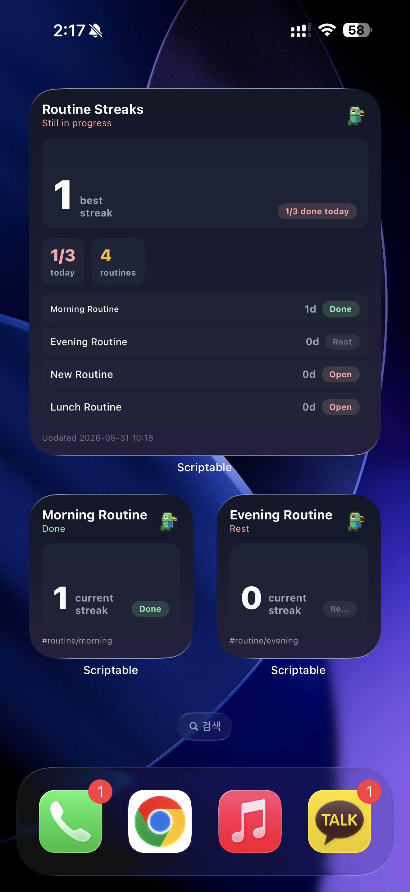
</p>

<p align="center">
  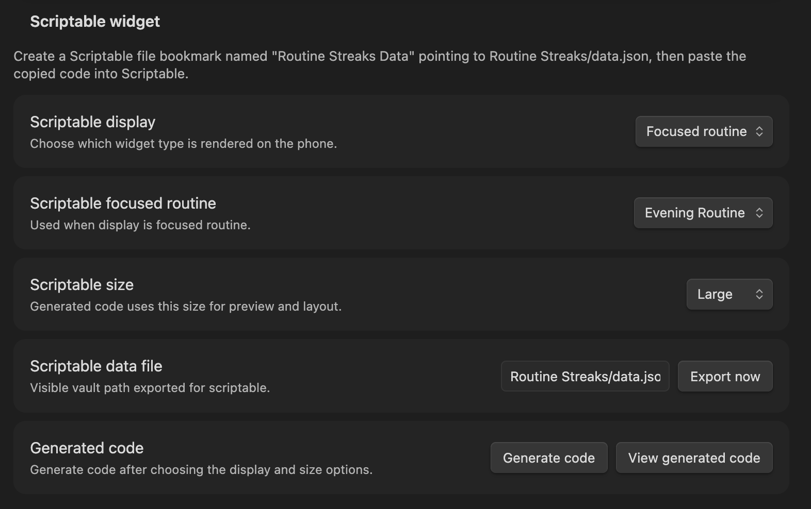
</p>

### Setup

1. In Obsidian, open **Settings → Routine Streaks → Scriptable widget**.
2. Choose the **Scriptable display** you want.
3. Choose the **Scriptable size**.
4. Click **Export now** to create or refresh the data file.
5. Click **Generate code** and copy the generated script.
6. In Scriptable, create a new script and paste the code.
7. In Scriptable, open **Settings → File Bookmarks**.
8. Create a file bookmark named exactly:

```text
Routine Streaks Data
```

9. Point that bookmark to the exported vault file, usually:

```text
Routine Streaks/data.json
```

10. Add the Scriptable script as an iOS/iPadOS widget.

### Scriptable Display Types

| Display           | Description                                                  |
| ----------------- | ------------------------------------------------------------ |
| `Dashboard`       | A larger dashboard with overview, pet, and routine progress. |
| `Overview`        | Best streak, today's progress, and pet status.               |
| `Pet`             | A focused pixel pet status widget.                           |
| `Routine cards`   | Routine progress cards.                                      |
| `Today items`     | Today's task status for selected routines.                   |
| `Focused routine` | One selected routine's streak and status.                    |

### Scriptable Sizes

Available sizes depend on the selected display:

| Display | Sizes |
| --- | --- |
| `Dashboard` | Large |
| `Overview` | Medium, Large |
| `Pet` | Small, Medium, Large |
| `Routine cards` | Medium, Large |
| `Today items` | Small, Medium, Large |
| `Focused routine` | Small, Medium, Large |

For `Focused routine`, choose which routine to show in **Scriptable focused routine**.

For `Today items`, choose which routine cards should appear. Small shows one routine. Medium and Large can show up to four routines.

### Refreshing Data

Use **Export now** whenever you want to manually refresh the data used by Scriptable. Routine Streaks also exports data when plugin settings are saved or streaks are recalculated.

If the iOS widget looks stale, open Obsidian on the device that has the latest vault data, run **Routine Streaks: Recalculate streaks**, then export again.

## Privacy

Routine Streaks works locally in your vault. It does not collect telemetry and does not send your notes to an external service.

## License

Routine Streaks is released under the MIT license.
